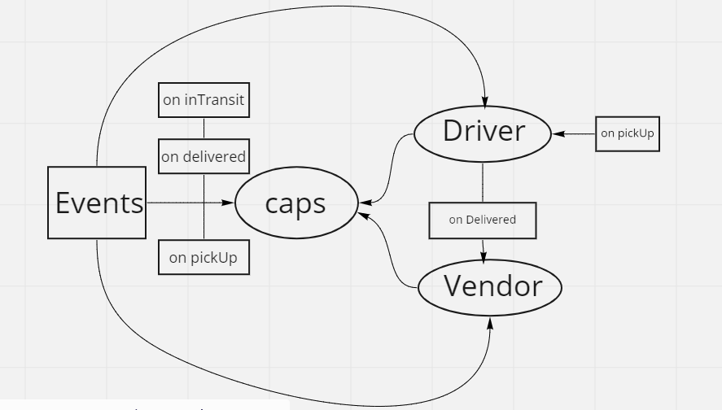

# caps




     ## dotenv

     STORE_NAME=Flowers

## output


```

EVENT { event: 'pickup',
    time: 2020-03-06T18:27:17.732Z,
    payload:
     { store: Flowers,
       orderID: 480ac237-5021-4b9e-8f5f-762cc7c7d8dc,
       customer: Miss Gladys Schinner,
       address: 13437 Lucius Lane }}
Driver: picked up 480ac237-5021-4b9e-8f5f-762cc7c7d8dc
EVENT { event: 'in-transit',
    time: 2020-03-06T18:27:18.738Z,
    payload:
     { store: Flowers,
       orderID: 480ac237-5021-4b9e-8f5f-762cc7c7d8dc,
       customer: Miss Gladys Schinner,
       address: 13437 Lucius Lane
DRIVER: delivered up 480ac237-5021-4b9e-8f5f-762cc7c7d8dc
VENDOR: Thank you for delivering  480ac237-5021-4b9e-8f5f-762cc7c7d8dc
EVENT { event: 'delivered',
  time:Sun Aug 29 2021 21:25:17 GMT-0700 (Pacific Daylight Time),
  payload:
   { store: Flowers,
     orderID: 480ac237-5021-4b9e-8f5f-762cc7c7d8dc,
     customer: Miss Gladys Schinner,
     address: 13437 Lucius Lane

     ```


